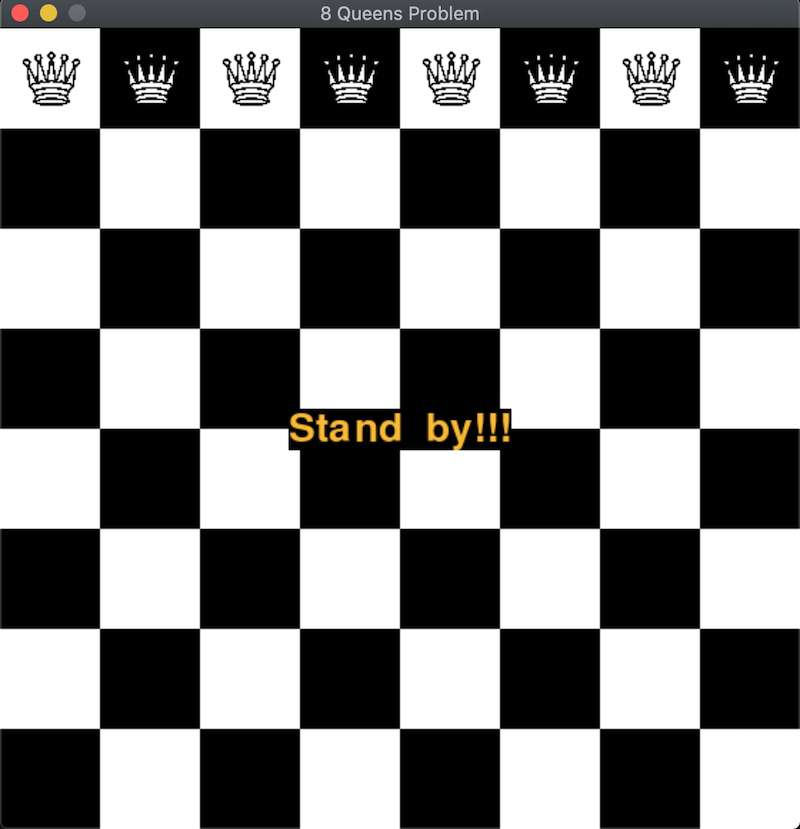

# Chess Problems
Chess and Mathematics: the knight's tour (closed) and the eight queens problem solved. The respective solutions are displayed (animated) using the pygame package.

The knight's tour is a sequence of moves of a knight on a chessboard such that the knight visits every square exactly once. If the knight ends on a square that is one knight's move from the beginning square (so that it could tour the board again immediately, following the same path), the tour is closed; otherwise, it is open.

The eight queens puzzle is the problem of placing eight chess queens on an 8×8 chessboard so that no two queens threaten each other; thus, a solution requires that no two queens share the same row, column, or diagonal.

## Requirements
Python 3.x, pygame and numpy.

## Running the program 
Right after execution, a GUI window will be launched. You will be able to run the animation by pressing the [enter] key and finishing the program by pressing keys [q] or [esc].    

